# Proyectos Android - Portafolio de Aplicaciones

Este documento describe tres proyectos Android desarrollados como parte del portafolio académico, cada uno implementando diferentes tecnologías y arquitecturas modernas para aplicaciones móviles.

---

## 📚 Proyecto Action - Biblioteca Digital

La aplicación **Biblioteca Digital** es una solución completa de gestión de libros que integra múltiples fuentes de datos y ofrece una experiencia de usuario fluida tanto online como offline. Este proyecto implementa una arquitectura robusta que combina una API REST personalizada desarrollada con Flask, la API pública de Open Library, y almacenamiento local con Room Database. La aplicación permite a los usuarios buscar libros por título o autor, gestionar una lista de favoritos, consultar su historial de búsquedas y recibir recomendaciones personalizadas basadas en sus preferencias. Cuenta con un sistema completo de autenticación que persiste la sesión del usuario mediante SharedPreferences, y sincroniza automáticamente los datos entre el servidor remoto y la base de datos local SQLite. Además, incluye un panel de administrador con estadísticas completas de usuarios, favoritos e historial de búsquedas. El proyecto utiliza Retrofit para las comunicaciones HTTP, implementa el patrón Repository para la gestión de datos, y sigue las mejores prácticas de desarrollo Android con Kotlin y arquitectura MVVM.

**Funcionalidades destacadas:**
- Sistema de autenticación completo (registro/login)
- Búsqueda de libros por título y autor
- Gestión de favoritos con sincronización
- Historial de búsquedas persistente
- Recomendaciones personalizadas
- Panel de administrador con estadísticas
- Funcionamiento offline con sincronización automática

**Requisitos de Configuración**
- Backend Flask corriendo en `http://localhost:5000`
- Configurar `BASE_URL` en `RetrofitClient.kt` según el entorno (emulador: `10.0.2.2:5000`, dispositivo físico: IP local)

### Screenshots
**Favoritos**

**Historial**
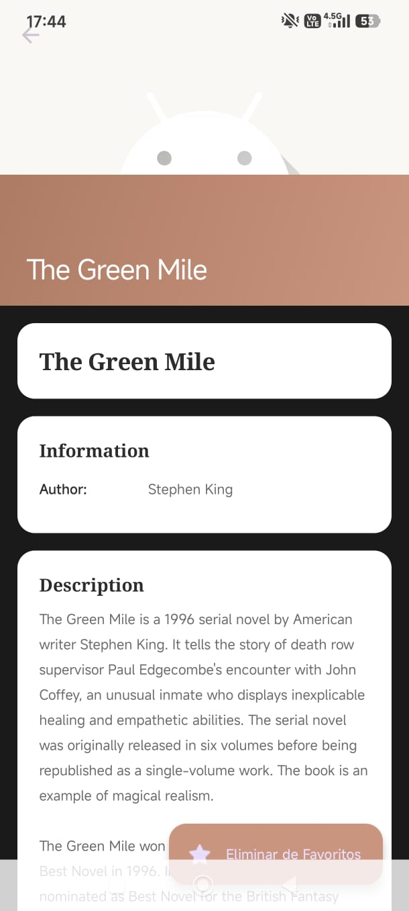

**Detalles de libro**
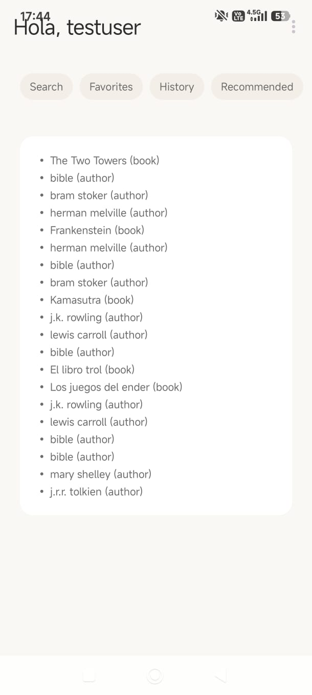
---

## 🗺️ Proyecto Examen - GPS Tracker

**Ubicación:** `Examen/`

**GPS Tracker** es una aplicación de rastreo de ubicación en tiempo real que demuestra el dominio de servicios en segundo plano, manejo de permisos complejos y visualización de datos geoespaciales. La aplicación utiliza la API de Google Maps para mostrar la posición actual del usuario en un mapa interactivo, dibuja el recorrido completo de la ruta seguida, y permite configurar diferentes intervalos de actualización (10 segundos, 60 segundos o 5 minutos) según las necesidades del usuario. Implementa un servicio en segundo plano que continúa rastreando la ubicación incluso cuando la aplicación no está en primer plano, con una notificación persistente que puede activarse o desactivarse según la preferencia del usuario. Todos los datos de ubicación (latitud, longitud, timestamp y precisión) se almacenan en una base de datos Room para su consulta posterior, y la aplicación incluye una pantalla de historial completo donde se pueden visualizar todos los registros guardados. El proyecto maneja correctamente los permisos de ubicación en tiempo de ejecución, incluyendo el permiso de ubicación en segundo plano requerido en Android 10+ y el permiso de notificaciones en Android 13+. La interfaz incluye temas personalizables con opciones de tema Guinda (IPN) y Azul (ESCOM), y soporte para modo claro/oscuro automático.

**Funcionalidades destacadas:**
- Rastreo GPS en tiempo real
- Visualización en Google Maps con marcadores
- Dibujo automático de la ruta recorrida
- Servicio en segundo plano
- Intervalos configurables (10s, 60s, 5min)
- Notificación persistente opcional
- Base de datos Room con historial completo
- Temas personalizables (Guinda/Azul)
- Manejo completo de permisos de ubicación
- Precisión de ubicación mostrada

**Requisitos de Configuración**
- API Key de Google Maps configurada en `AndroidManifest.xml`
- Maps SDK for Android habilitado en Google Cloud Console
- Permisos de ubicación otorgados en tiempo de ejecución

### Screenshots
**Main**
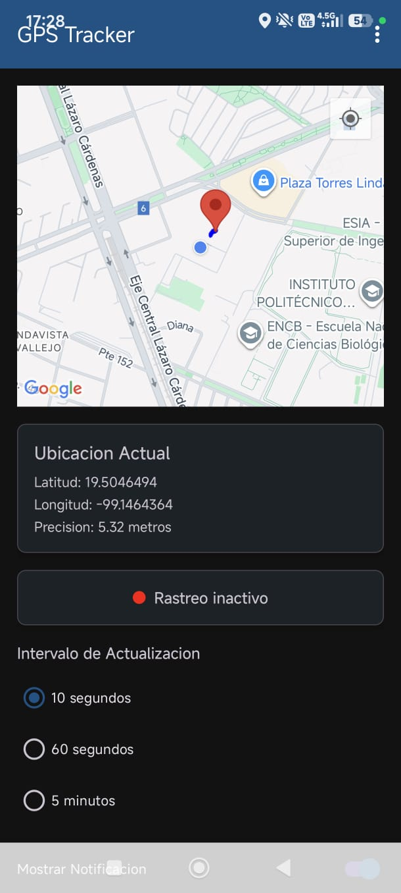

---

## 🏛️ Proyecto Project - Plataforma de Participación Ciudadana

**Ubicación:** `Project/`

La **Plataforma de Participación Ciudadana** es una aplicación integral para gestionar reportes ciudadanos que combina Firebase Cloud Services, Google Maps y una arquitectura MVVM completa. Este proyecto permite a los ciudadanos reportar incidencias de diferentes categorías (servicios públicos, seguridad, corrupción, violencia de género, narcomenudeo y reportes generales) mediante formularios diferenciados según el tipo de incidencia. Cada reporte captura automáticamente las coordenadas GPS del lugar, permite adjuntar fotografías desde la cámara o galería, y ofrece la opción de usar un alias para mantener el anonimato del reportante. La aplicación incluye un módulo de mapa interactivo que visualiza todos los reportes con marcadores de colores según su categoría, implementa un sistema de semáforo (heatmap) que indica zonas de alto, medio o bajo riesgo basándose en la densidad de reportes, y permite ver detalles completos al tocar cualquier marcador. Además, cuenta con un directorio de 30 instituciones de la CDMX con funcionalidades interactivas como llamadas directas, apertura en Google Maps y acceso a sitios web. El proyecto utiliza Firebase Cloud Firestore para almacenar los reportes con sincronización en tiempo real, Firebase Cloud Storage para las fotografías, y sigue una arquitectura MVVM con separación clara de responsabilidades mediante ViewModels, Repositories y Models, utilizando ViewBinding para una gestión segura de las vistas.

**Funcionalidades destacadas:**
- 6 tipos de reportes con formularios específicos
- Captura automática de GPS
- Carga de fotografías (cámara/galería)
- Sistema de alias para anonimato
- Mapa interactivo con marcadores por categoría
- Sistema de semáforo por densidad de reportes
- Directorio de 30 instituciones de CDMX
- Buscador y filtros de instituciones
- Llamadas directas y navegación a ubicaciones
- Sincronización en tiempo real con Firebase
- Vista detallada de reportes

**Requisitos de Configuración**
- Archivo `google-services.json` en la carpeta `app/`
- Cloud Firestore habilitado en Firebase Console
- Cloud Storage habilitado en Firebase Console
- API Key de Google Maps configurada en `AndroidManifest.xml`

### Screenshots
**Mapa Main**
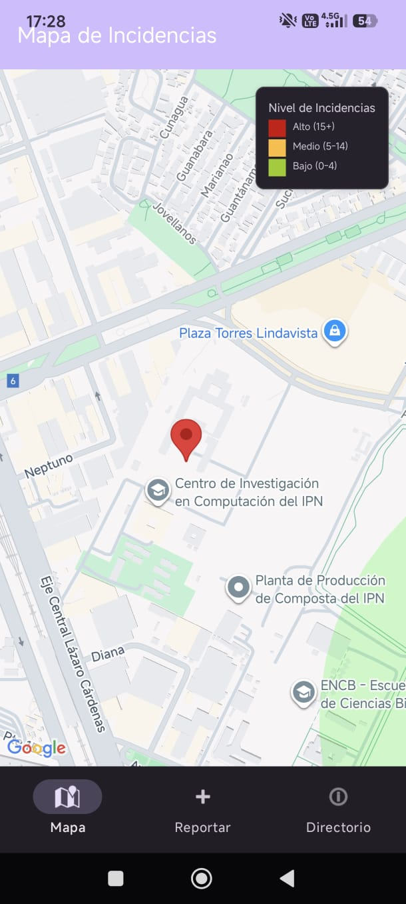

**Formulario de Reporte**
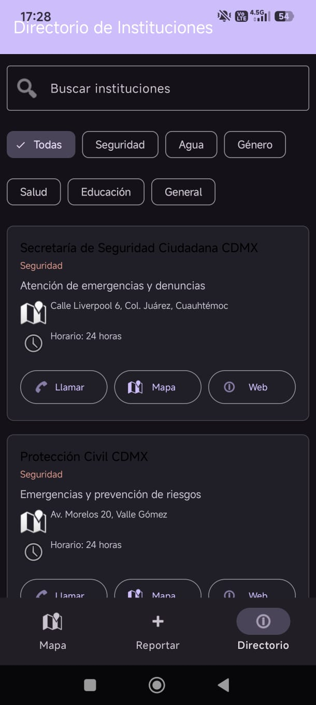

**Directorio de Instituciones**
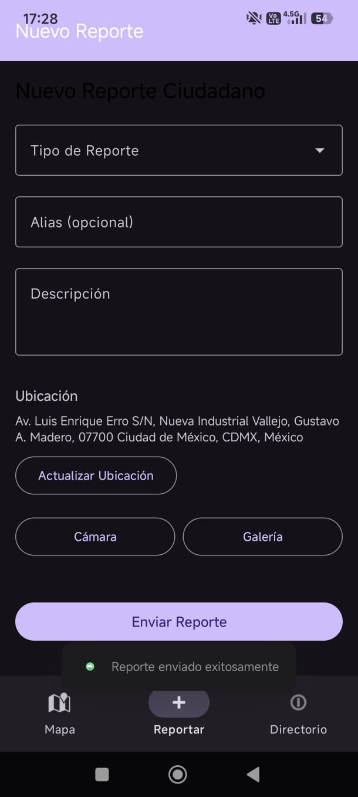

---

## 💣 Buscaminas Multijugador - Android

Una implementación moderna del clásico juego Buscaminas para **dos jugadores**, desarrollada con Jetpack Compose y siguiendo la arquitectura MVVM. Ahora con **soporte Bluetooth** para jugar en dos dispositivos diferentes.

### Modos de Juego
- ✅ **Modo Local**: Dos jugadores en el mismo dispositivo (original)
- ✅ **Modo Bluetooth** ⭐ NUEVO: Juego multidispositivo mediante conexión Bluetooth
  - Conexión servidor/cliente
  - Sincronización en tiempo real
  - Validación de turnos por dispositivo

### Screenshots
**Buscaminas Main**
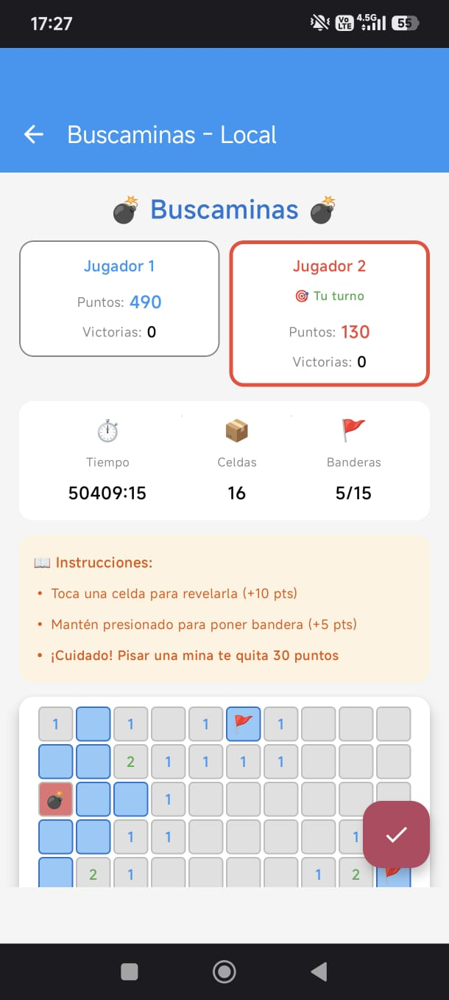

**Vista de Partida**
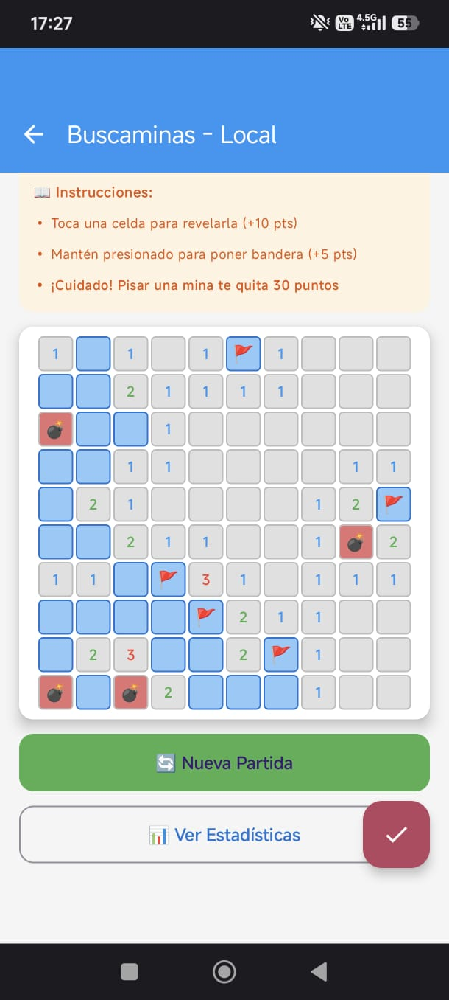

**Vista del Mapa**
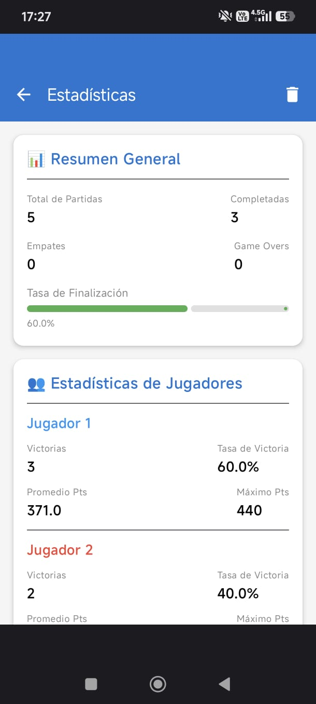

**Estadísticas**
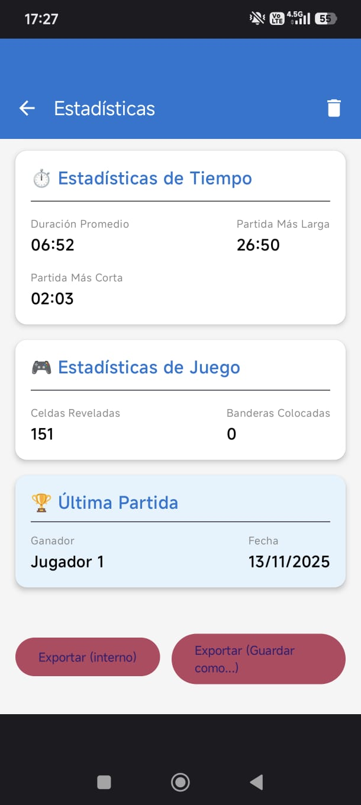

**Estadísticas P2**
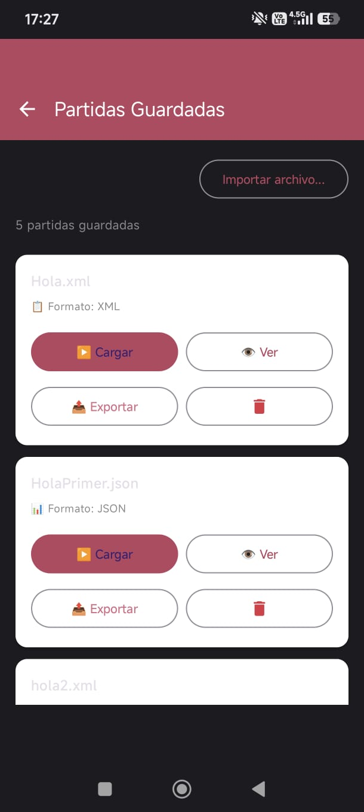

**Vista de Partidas Guardadas**
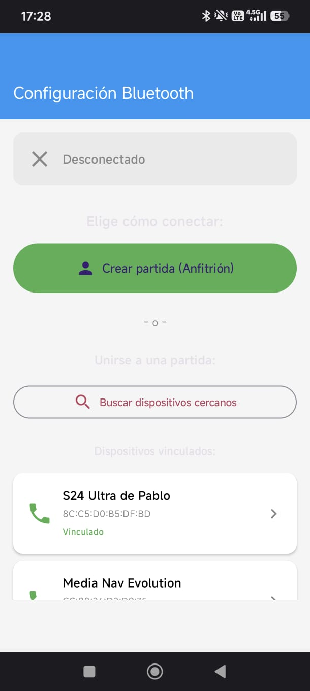

**Vista de Partidas Bluetooth**
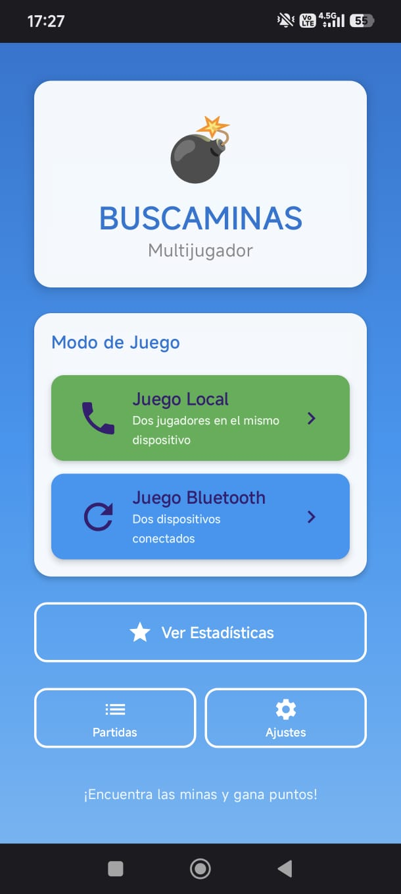

---
## Gestor de Archivos - Aplicación Nativa Android

Gestor de Archivos es una aplicación nativa para Android que permite explorar, visualizar y gestionar archivos del dispositivo. Desarrollada específicamente para el curso de Desarrollo de Aplicaciones Móviles Nativas de ESCOM-IPN.

### Exploración de Archivos
- ✅ Navegación por directorios del almacenamiento interno y externo
- ✅ Estructura jerárquica con breadcrumbs de navegación
- ✅ Vista de lista y cuadrícula intercambiables
- ✅ Información detallada de archivos (nombre, tamaño, fecha de modificación)

### Visualización de Archivos
- ✅ Visor de archivos de texto (.txt, .md, .log, .json, .xml)
- ✅ Visor de imágenes con zoom, desplazamiento y rotación
- ✅ Apertura de archivos no soportados con aplicaciones externas mediante Intents

### Screenshots

| Modo Tema Guinda IPN | Modo Tema Azul ESCOM |
|------------|-------------|
|  |  |

---
## App Android NFL NFC West con Navegación por Gestos, Jerarquía de 3 Niveles y Cambio de Temas

Este proyecto es una aplicación móvil nativa desarrollada en **Android** utilizando **Kotlin** como lenguaje principal con integración de **Java**. La aplicación presenta información detallada sobre los equipos de la **División Oeste de la Conferencia Nacional (NFC West) de la NFL**, implementando una navegación por gestos intuitiva, una arquitectura de información con **tres niveles jerárquicos** y un **sistema completo de cambio de temas** (claro/oscuro).

### Funcionalidades Principales

🎨 **Sistema de Cambio de Temas**
- **Tema Claro**: Interfaz luminosa con colores brillantes y fondo claro
- **Tema Oscuro**: Interfaz oscura optimizada para uso nocturno y ahorro de batería
- **Switch interactivo**: Cambio instantáneo entre temas desde la pantalla principal
- **Persistencia**: Las preferencias de tema se guardan automáticamente
- **Aplicación global**: El tema seleccionado se aplica a toda la aplicación

🏈 **Navegación por Equipos**
- Navegación horizontal por gestos (swipe) entre los 4 equipos de la NFC West
- Cards interactivas con animaciones y efectos visuales
- Acceso directo a información detallada de cada equipo

### Screenshots

#### Nivel 1 - Vista de Equipos

**San Francisco 49ers**

**Arizona Cardinals**

**Los Angeles Rams**
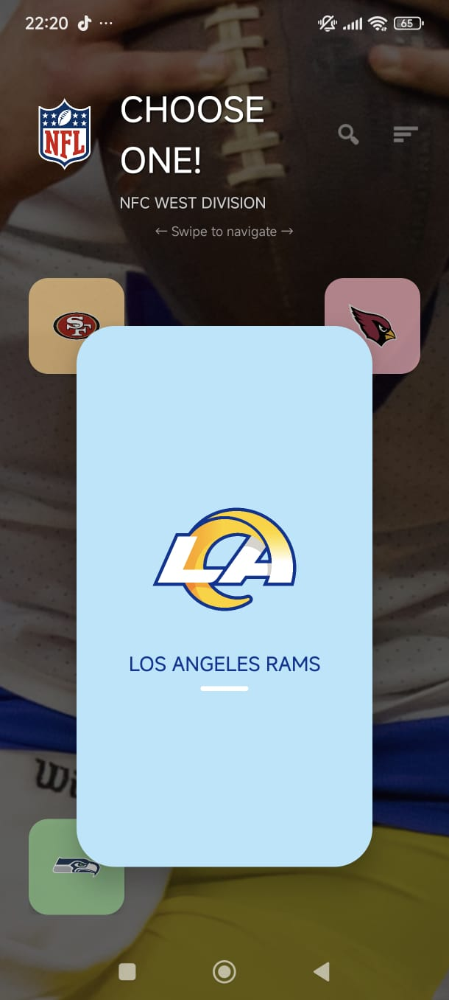

**Seattle Seahawks**

#### Nivel 2 - Información Detallada

**Vista de Información con Pestañas**

#### Nivel 3 - Contenido por Pestañas

**Overview Fragment**

**Players Fragment**

**Statistics Fragment**

