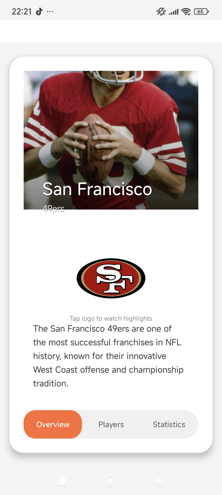

# App Android NFL NFC West con Navegación por Gestos y Jerarquía de 3 Niveles

Este proyecto es una aplicación móvil nativa desarrollada en **Android** utilizando **Kotlin** como lenguaje principal con integración de **Java**. La aplicación presenta información detallada sobre los equipos de la **División Oeste de la Conferencia Nacional (NFC West) de la NFL**, implementando una navegación por gestos intuitiva y una arquitectura de información con **tres niveles jerárquicos**.

## Descripción de la App

La app está diseñada con una arquitectura moderna de Android, presentando los cuatro equipos de la NFC West: **San Francisco 49ers**, **Arizona Cardinals**, **Los Angeles Rams** y **Seattle Seahawks**. La interfaz utiliza navegación por swipe (deslizamiento) entre equipos y navegación por pestañas dentro de cada sección de información detallada, ofreciendo una experiencia de usuario fluida e intuitiva.

### Jerarquía de Navegación (3 Niveles)

#### **Nivel 1: Selección de Equipos** (Main Activities)
- Vista principal con cards interactivas de los 4 equipos
- Navegación horizontal por gestos (swipe) entre equipos
- Click en card del equipo activo para acceder al nivel 2
- Animaciones y transiciones suaves

#### **Nivel 2: Información Detallada del Equipo** (Info Activities)
- Pantalla de información completa del equipo seleccionado
- Navegación por pestañas (TabLayout + ViewPager2) con 3 secciones
- Diseño personalizado con colores y logos del equipo

#### **Nivel 3: Secciones de Contenido** (Fragments)
- **Overview**: Información general del equipo
- **Players**: Listado de jugadores destacados
- **Statistics**: Estadísticas y datos del equipo

### Tecnologías utilizadas

- **Kotlin**: Lenguaje principal para la lógica de negocio y UI
- **Java**: Integración con componentes de Android
- **Android SDK**: Framework nativo para desarrollo móvil
- **Material Design 3**: Sistema de diseño moderno y consistente
- **ViewPager2**: Navegación por pestañas fluida
- **CardView**: Componentes visuales elevados
- **ConstraintLayout**: Diseño responsive y flexible
- **GestureDetector**: Detección de gestos táctiles (swipe)

## Instrucciones de Uso

1. **Clona el repositorio**
   ```bash
   git clone https://github.com/GarciaGarciaAramJesua/Android.git
   ```

2. **Navega al directorio del proyecto Android**
   ```bash
   cd AndroidStudioProjects/Practica2
   ```

3. **Abre el proyecto en Android Studio**
   - Abre Android Studio
   - Selecciona "Open an existing project"
   - Navega hasta la carpeta `Practica2`

4. **Sincroniza las dependencias**
   - Android Studio sincronizará automáticamente las dependencias de Gradle
   - Espera a que el proceso termine (puede tomar algunos minutos)

5. **Ejecuta la aplicación**
   - Conecta un dispositivo físico con depuración USB activada o usa un emulador AVD
   - Click en el botón "Run" (▶) o presiona `Shift + F10`
   ```bash
   # O desde terminal
   ./gradlew installDebug
   ```

6. **Navegación**
   - **Swipe horizontal**: Desliza izquierda/derecha para navegar entre equipos
   - **Click en card activa**: Accede a información detallada del equipo
   - **Click en cards inactivas**: Navega al equipo correspondiente
   - **Pestañas superiores**: Cambia entre Overview, Players y Statistics

## Estructura del Proyecto

```
app/src/main/
├── java/com/example/practica2/
│   ├── MainActivity.kt              # Nivel 1: San Francisco 49ers
│   ├── SecondActivity.kt            # Nivel 1: Arizona Cardinals
│   ├── ThirdActivity.kt             # Nivel 1: Los Angeles Rams
│   ├── FourthActivity.kt            # Nivel 1: Seattle Seahawks
│   ├── NinersInfoActivity.kt        # Nivel 2: Info 49ers
│   ├── CardinalsInfoActivity.kt     # Nivel 2: Info Cardinals
│   ├── RamsInfoActivity.kt          # Nivel 2: Info Rams
│   ├── SeahawksInfoActivity.kt      # Nivel 2: Info Seahawks
│   ├── OverviewFragment.kt          # Nivel 3: Vista general
│   ├── PlayersFragment.kt           # Nivel 3: Jugadores
│   └── StatisticsFragment.kt        # Nivel 3: Estadísticas
├── res/
│   ├── layout/                      # Layouts XML de cada pantalla
│   ├── drawable/                    # Recursos gráficos e imágenes
│   ├── values/                      # Colores, strings, estilos
│   └── anim/                        # Animaciones
└── AndroidManifest.xml              # Configuración de la app
```

## Definición de Pantallas

### Nivel 1 - Activities de Equipos
- **MainActivity**: Pantalla principal de **San Francisco 49ers** con navegación por gestos
- **SecondActivity**: Pantalla de **Arizona Cardinals** con navegación por gestos
- **ThirdActivity**: Pantalla de **Los Angeles Rams** con navegación por gestos
- **FourthActivity**: Pantalla de **Seattle Seahawks** con navegación por gestos

### Nivel 2 - Activities de Información Detallada
- **NinersInfoActivity**: Información completa de los 49ers con navegación por pestañas
- **CardinalsInfoActivity**: Información completa de los Cardinals con navegación por pestañas
- **RamsInfoActivity**: Información completa de los Rams con navegación por pestañas
- **SeahawksInfoActivity**: Información completa de los Seahawks con navegación por pestañas

### Nivel 3 - Fragments de Contenido
- **OverviewFragment**: Información general, historia y descripción del equipo
- **PlayersFragment**: Lista de jugadores destacados con sus posiciones
- **StatisticsFragment**: Estadísticas, récords y datos del equipo

## Características Implementadas

✅ **Navegación por Gestos**: Swipe horizontal para cambiar entre equipos
✅ **Navegación por Pestañas**: TabLayout con ViewPager2 para secciones de información
✅ **Arquitectura de 3 Niveles**: Jerarquía clara de información
✅ **Material Design 3**: Interfaz moderna y consistente
✅ **Animaciones Fluidas**: Transiciones suaves entre pantallas
✅ **CardView Interactivas**: Elementos visuales elevados y responsivos
✅ **Colores Temáticos**: Cada equipo con su paleta de colores oficial
✅ **Edge-to-Edge Display**: Soporte para pantallas modernas
✅ **Responsive Design**: Adaptable a diferentes tamaños de pantalla

## Screenshots

Se presentan las screenshots de las vistas del proyecto (Se pueden encontrar más en `./screenshots/`)

### Nivel 1 - Vista de Equipos

#### San Francisco 49ers


#### Arizona Cardinals


#### Los Angeles Rams


#### Seattle Seahawks


### Nivel 2 - Información Detallada

#### Vista de Información con Pestañas


### Nivel 3 - Contenido por Pestañas

#### Overview Fragment


#### Players Fragment


#### Statistics Fragment


## Configuración de Desarrollo

### Requisitos
- **Android Studio**: Arctic Fox o superior
- **Gradle**: 8.0+
- **Kotlin**: 1.9+
- **SDK Mínimo**: API 24 (Android 7.0)
- **SDK Target**: API 34 (Android 14)

### Dependencias Principales
```gradle
implementation "androidx.appcompat:appcompat:1.6.1"
implementation "com.google.android.material:material:1.11.0"
implementation "androidx.constraintlayout:constraintlayout:2.1.4"
implementation "androidx.viewpager2:viewpager2:1.0.0"
implementation "androidx.cardview:cardview:1.0.0"
```

**NFL NFC West App** - Una aplicación moderna para explorar los equipos de la División Oeste de la NFC
