# App Android NFL NFC West con Navegación por Gestos, Jerarquía de 3 Niveles y Cambio de Temas

Este proyecto es una aplicación móvil nativa desarrollada en **Android** utilizando **Kotlin** como lenguaje principal con integración de **Java**. La aplicación presenta información detallada sobre los equipos de la **División Oeste de la Conferencia Nacional (NFC West) de la NFL**, implementando una navegación por gestos intuitiva, una arquitectura de información con **tres niveles jerárquicos** y un **sistema completo de cambio de temas** (claro/oscuro).

## Descripción de la App

La app está diseñada con una arquitectura moderna de Android, presentando los cuatro equipos de la NFC West: **San Francisco 49ers**, **Arizona Cardinals**, **Los Angeles Rams** y **Seattle Seahawks**. La interfaz utiliza navegación por swipe (deslizamiento) entre equipos y navegación por pestañas dentro de cada sección de información detallada, ofreciendo una experiencia de usuario fluida e intuitiva.

### Funcionalidades Principales

🎨 **Sistema de Cambio de Temas**
- **Tema Claro**: Interfaz luminosa con colores brillantes y fondo claro
- **Tema Oscuro**: Interfaz oscura optimizada para uso nocturno y ahorro de batería
- **Switch interactivo**: Cambio instantáneo entre temas desde la pantalla principal
- **Persistencia**: Las preferencias de tema se guardan automáticamente
- **Aplicación global**: El tema seleccionado se aplica a toda la aplicación

🏈 **Navegación por Equipos**
- Navegación horizontal por gestos (swipe) entre los 4 equipos de la NFC West
- Cards interactivas con animaciones y efectos visuales
- Acceso directo a información detallada de cada equipo

### Jerarquía de Navegación (3 Niveles)

#### **Nivel 1: Selección de Equipos** (Main Activities)
- Vista principal con cards interactivas de los 4 equipos
- Navegación horizontal por gestos (swipe) entre equipos
- Click en card del equipo activo para acceder al nivel 2
- Animaciones y transiciones suaves

#### **Nivel 2: Información Detallada del Equipo** (Info Activities)
- Pantalla de información completa del equipo seleccionado
- Navegación por pestañas (TabLayout + ViewPager2) con 3 secciones
- Diseño personalizado con colores y logos del equipo

#### **Nivel 3: Secciones de Contenido** (Fragments)
- **Overview**: Información general del equipo
- **Players**: Listado de jugadores destacados
- **Statistics**: Estadísticas y datos del equipo

### Tecnologías utilizadas

- **Kotlin**: Lenguaje principal para la lógica de negocio y UI
- **Java**: Integración con componentes de Android
- **Android SDK**: Framework nativo para desarrollo móvil
- **Material Design 3**: Sistema de diseño moderno y consistente
- **SharedPreferences**: Persistencia de preferencias de usuario (tema seleccionado)
- **ViewPager2**: Navegación por pestañas fluida
- **CardView**: Componentes visuales elevados
- **ConstraintLayout**: Diseño responsive y flexible
- **GestureDetector**: Detección de gestos táctiles (swipe)
- **SwitchCompat**: Control interactivo para cambio de tema

## Instrucciones de Uso

1. **Clona el repositorio**
   ```bash
   git clone https://github.com/GarciaGarciaAramJesua/Android.git
   ```

2. **Navega al directorio del proyecto Android**
   ```bash
   cd AndroidStudioProjects/Practica2
   ```

3. **Abre el proyecto en Android Studio**
   - Abre Android Studio
   - Selecciona "Open an existing project"
   - Navega hasta la carpeta `Practica2`

4. **Sincroniza las dependencias**
   - Android Studio sincronizará automáticamente las dependencias de Gradle
   - Espera a que el proceso termine (puede tomar algunos minutos)

5. **Ejecuta la aplicación**
   - Conecta un dispositivo físico con depuración USB activada o usa un emulador AVD
   - Click en el botón "Run" (▶) o presiona `Shift + F10`
   ```bash
   # O desde terminal
   ./gradlew installDebug
   ```

6. **Navegación**
   - **Swipe horizontal**: Desliza izquierda/derecha para navegar entre equipos
   - **Click en card activa**: Accede a información detallada del equipo
   - **Click en cards inactivas**: Navega al equipo correspondiente
   - **Pestañas superiores**: Cambia entre Overview, Players y Statistics
   - **Switch de tema**: Usa el interruptor en la esquina superior derecha para cambiar entre tema claro y oscuro

## Estructura del Proyecto

```
app/src/main/
├── java/com/example/practica2/
│   ├── MainActivity.kt              # Nivel 1: San Francisco 49ers
│   ├── SecondActivity.kt            # Nivel 1: Arizona Cardinals
│   ├── ThirdActivity.kt             # Nivel 1: Los Angeles Rams
│   ├── FourthActivity.kt            # Nivel 1: Seattle Seahawks
│   ├── BaseActivity.kt              # Activity base con manejo de temas
│   ├── ThemeManager.kt              # Gestor de temas y preferencias
│   ├── NinersInfoActivity.kt        # Nivel 2: Info 49ers
│   ├── CardinalsInfoActivity.kt     # Nivel 2: Info Cardinals
│   ├── RamsInfoActivity.kt          # Nivel 2: Info Rams
│   ├── SeahawksInfoActivity.kt      # Nivel 2: Info Seahawks
│   ├── OverviewFragment.kt          # Nivel 3: Vista general
│   ├── PlayersFragment.kt           # Nivel 3: Jugadores
│   └── StatisticsFragment.kt        # Nivel 3: Estadísticas
├── res/
│   ├── layout/                      # Layouts XML de cada pantalla
│   ├── drawable/                    # Recursos gráficos e imágenes
│   ├── values/
│   │   ├── colors.xml               # Colores para tema claro y oscuro
│   │   ├── themes.xml               # Definición de temas
│   │   └── strings.xml              # Textos de la aplicación
│   └── anim/                        # Animaciones
└── AndroidManifest.xml              # Configuración de la app
```

## Definición de Pantallas

### Sistema de Temas
- **BaseActivity**: Clase base que maneja la aplicación automática de temas para todas las activities
- **ThemeManager**: Singleton que gestiona las preferencias de tema y su persistencia mediante SharedPreferences

### Nivel 1 - Activities de Equipos
- **MainActivity**: Pantalla principal de **San Francisco 49ers** con navegación por gestos
- **SecondActivity**: Pantalla de **Arizona Cardinals** con navegación por gestos
- **ThirdActivity**: Pantalla de **Los Angeles Rams** con navegación por gestos
- **FourthActivity**: Pantalla de **Seattle Seahawks** con navegación por gestos

### Nivel 2 - Activities de Información Detallada
- **NinersInfoActivity**: Información completa de los 49ers con navegación por pestañas
- **CardinalsInfoActivity**: Información completa de los Cardinals con navegación por pestañas
- **RamsInfoActivity**: Información completa de los Rams con navegación por pestañas
- **SeahawksInfoActivity**: Información completa de los Seahawks con navegación por pestañas

### Nivel 3 - Fragments de Contenido
- **OverviewFragment**: Información general, historia y descripción del equipo
- **PlayersFragment**: Lista de jugadores destacados con sus posiciones
- **StatisticsFragment**: Estadísticas, récords y datos del equipo

## Características Implementadas

✅ **Sistema de Cambio de Temas**: Switch interactivo con persistencia de preferencias  
✅ **Tema Claro y Oscuro**: Dos esquemas de colores completos siguiendo Material Design 3  
✅ **Persistencia de Tema**: Las preferencias se guardan automáticamente usando SharedPreferences  
✅ **Aplicación Global**: El tema seleccionado se aplica a toda la aplicación  
✅ **Navegación por Gestos**: Swipe horizontal para cambiar entre equipos  
✅ **Navegación por Pestañas**: TabLayout con ViewPager2 para secciones de información  
✅ **Arquitectura de 3 Niveles**: Jerarquía clara de información  
✅ **Material Design 3**: Interfaz moderna y consistente  
✅ **Animaciones Fluidas**: Transiciones suaves entre pantallas  
✅ **CardView Interactivas**: Elementos visuales elevados y responsivos  
✅ **Colores Temáticos**: Cada equipo con su paleta de colores oficial  
✅ **Edge-to-Edge Display**: Soporte para pantallas modernas  
✅ **Responsive Design**: Adaptable a diferentes tamaños de pantalla

## Screenshots

Se presentan las screenshots de las vistas del proyecto (Se pueden encontrar más en `./screenshots/`)

### Nivel 1 - Vista de Equipos

#### San Francisco 49ers


#### Arizona Cardinals


#### Los Angeles Rams


#### Seattle Seahawks


### Nivel 2 - Información Detallada

#### Vista de Información con Pestañas


### Nivel 3 - Contenido por Pestañas

#### Overview Fragment


#### Players Fragment


#### Statistics Fragment


### Comparación de Temas

#### Tema Claro vs Tema Oscuro - Pantalla Principal
| Tema Claro | Tema Oscuro |
|------------|-------------|
| 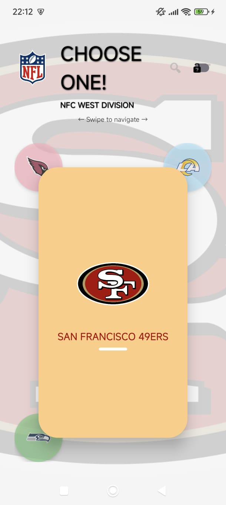 | 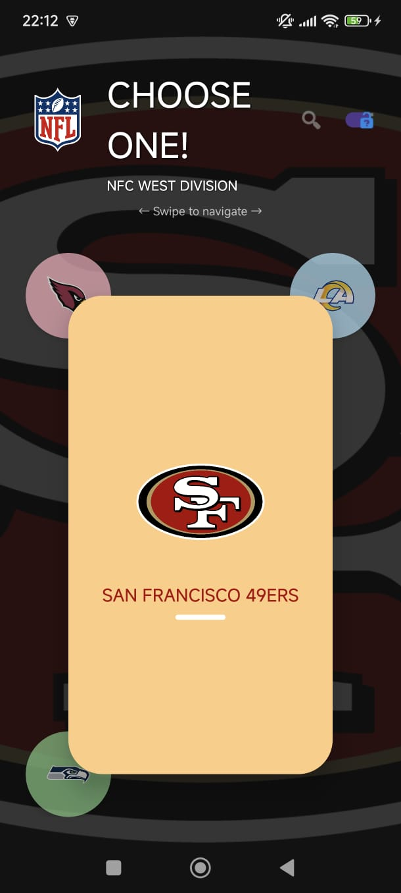 |

#### Tema Claro vs Tema Oscuro - Información Detallada
| Tema Claro | Tema Oscuro |
|------------|-------------|
| 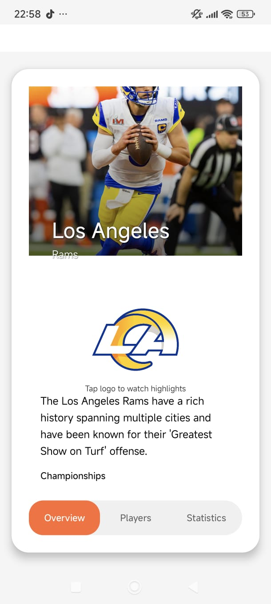 | 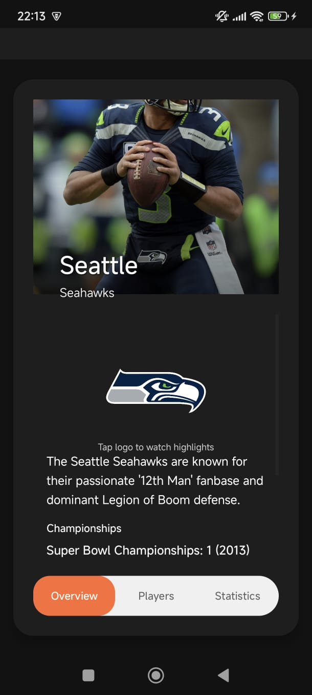 |

### Switch de Cambio de Tema

#### Demostración del Switch
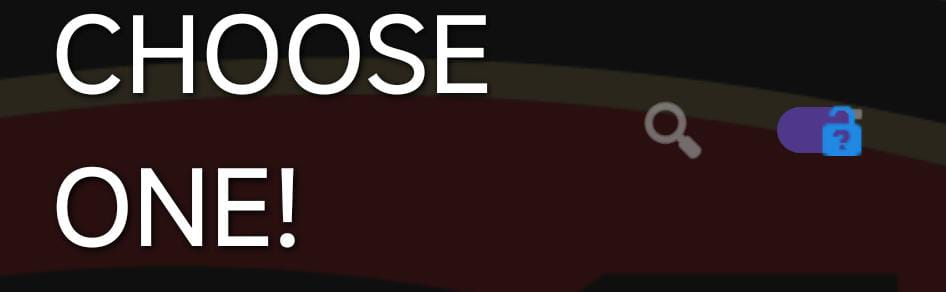
Switch ubicado en la esquina superior derecha para cambio instantáneo entre temas

### Nivel 1 - Vista de Equipos

#### San Francisco 49ers
| Tema Claro | Tema Oscuro |
|------------|-------------|
|  |  |

#### Arizona Cardinals
| Tema Claro | Tema Oscuro |
|------------|-------------|
| 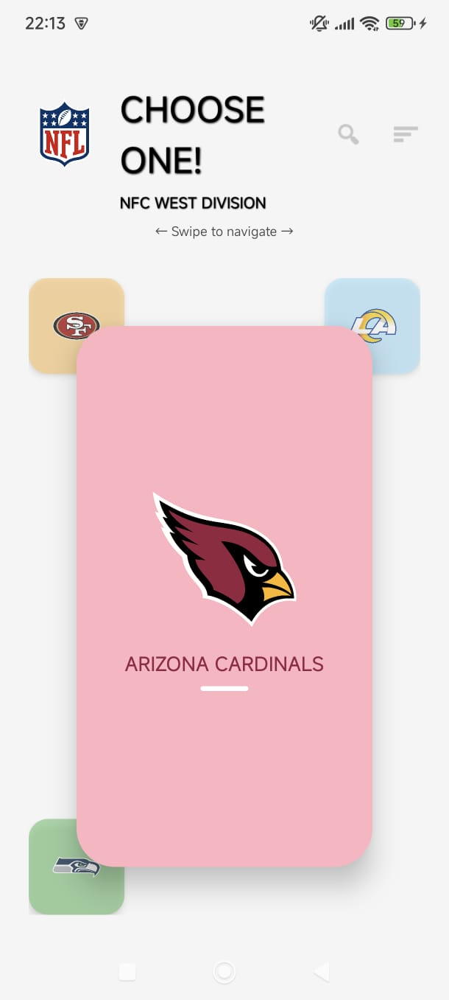 | 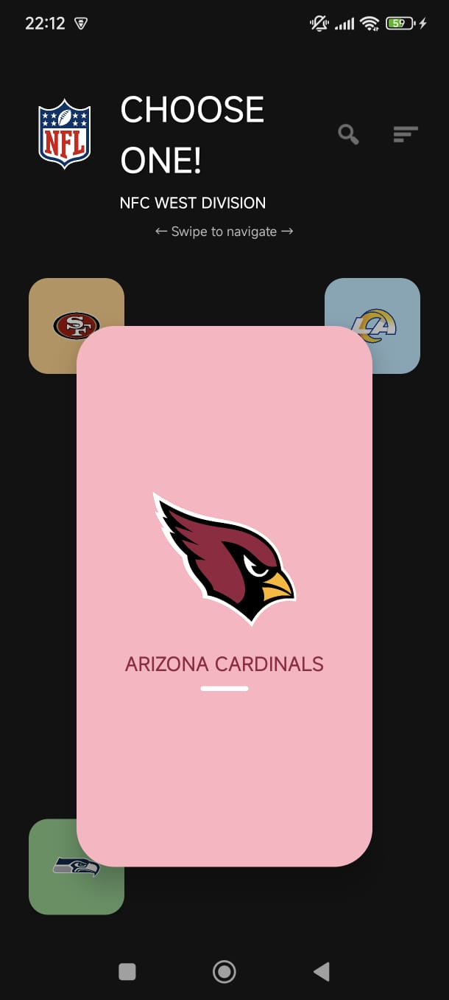 |

#### Los Angeles Rams
| Tema Claro | Tema Oscuro |
|------------|-------------|
|  | 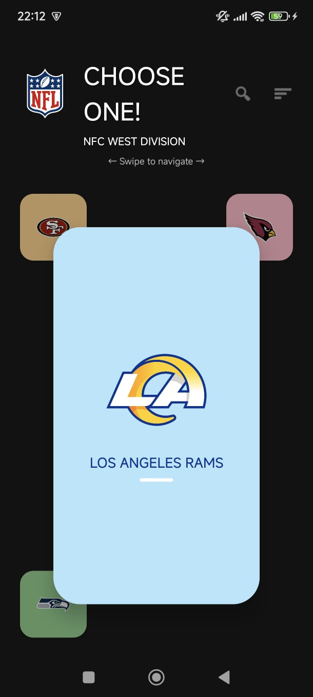 |

#### Seattle Seahawks
| Tema Claro | Tema Oscuro |
|------------|-------------|
| 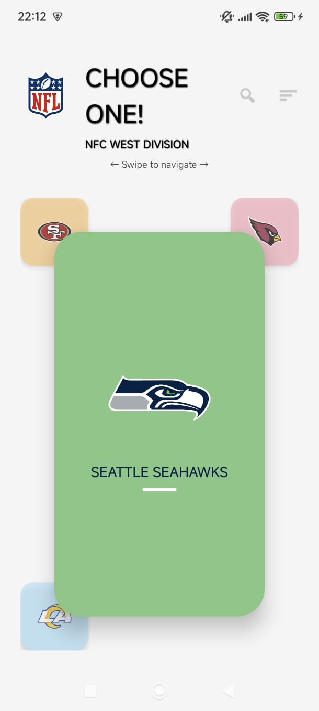 |  |

### Nivel 2 - Información Detallada

#### Vista de Información con Pestañas - Comparación de Temas
| Tema Claro | Tema Oscuro |
|------------|-------------|
|  |  |

### Nivel 3 - Contenido por Pestañas

#### Overview Fragment
| Tema Claro | Tema Oscuro |
|------------|-------------|
|  |  |

#### Players Fragment
| Tema Claro | Tema Oscuro |
|------------|-------------|
|  | 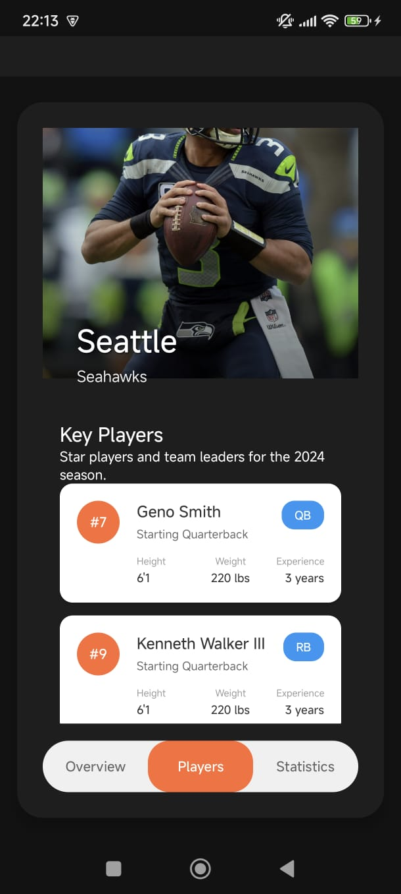 |

#### Statistics Fragment
| Tema Claro | Tema Oscuro |
|------------|-------------|
| 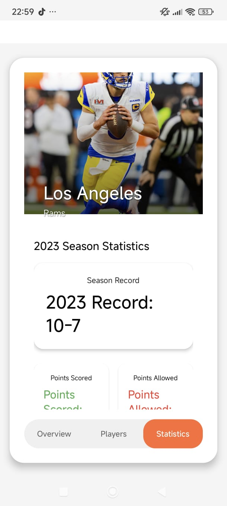 | 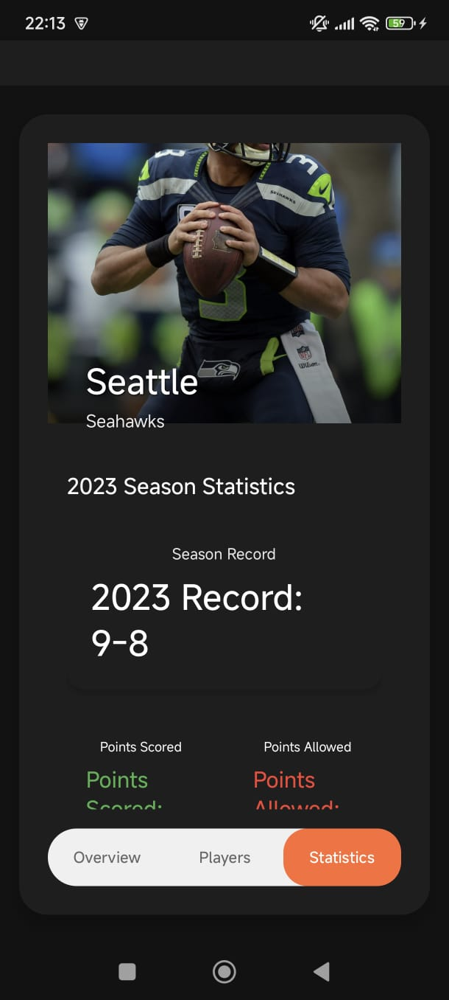 |

## Configuración de Desarrollo

### Requisitos
- **Android Studio**: Arctic Fox o superior
- **Gradle**: 8.0+
- **Kotlin**: 1.9+
- **SDK Mínimo**: API 24 (Android 7.0)
- **SDK Target**: API 34 (Android 14)

### Dependencias Principales
```gradle
implementation "androidx.appcompat:appcompat:1.6.1"
implementation "com.google.android.material:material:1.11.0"
implementation "androidx.constraintlayout:constraintlayout:2.1.4"
implementation "androidx.viewpager2:viewpager2:1.0.0"
implementation "androidx.cardview:cardview:1.0.0"
```

## Implementación del Sistema de Temas

### Arquitectura del Sistema de Temas

El sistema de cambio de temas está implementado siguiendo las mejores prácticas de Android:

#### **1. ThemeManager (Singleton)**
```kotlin
object ThemeManager {
    fun setDarkMode(context: Context, isDarkMode: Boolean)
    fun isDarkMode(context: Context): Boolean
    fun applyTheme(activity: AppCompatActivity)
    fun toggleTheme(activity: AppCompatActivity)
}
```

#### **2. BaseActivity (Clase Base)**
```kotlin
open class BaseActivity : AppCompatActivity() {
    override fun onCreate(savedInstanceState: Bundle?) {
        ThemeManager.applyTheme(this)  // Aplicar tema antes de super.onCreate()
        super.onCreate(savedInstanceState)
    }
}
```

#### **3. Configuración en MainActivity**
```kotlin
private fun setupThemeSwitch() {
    val switchTheme = findViewById<SwitchCompat>(R.id.switchTheme)
    switchTheme.isChecked = ThemeManager.isDarkMode(this)
    switchTheme.setOnCheckedChangeListener { _, isChecked ->
        ThemeManager.setDarkMode(this, isChecked)
        recreate()  // Aplicar tema inmediatamente
    }
}
```

### Persistencia de Datos
- **SharedPreferences**: Las preferencias de tema se guardan automáticamente
- **Clave de almacenamiento**: `"isDarkModeEnabled"`
- **Persistencia entre sesiones**: El tema se mantiene al cerrar y abrir la app

### Esquemas de Color

#### **Tema Claro**
- Background: `#F5F5F5` (Gris claro)
- Surface: `#FFFFFF` (Blanco)
- Primary: `#2196F3` (Azul Material)
- Text: `#000000` (Negro)

#### **Tema Oscuro**
- Background: `#121212` (Negro Material)
- Surface: `#1E1E1E` (Gris oscuro)
- Primary: `#1E88E5` (Azul oscuro)
- Text: `#FFFFFF` (Blanco)

## Autor

Desarrollado por **García García Aram Jesúa**

---

**NFL NFC West App** - Una aplicación moderna para explorar los equipos de la División Oeste de la NFC
