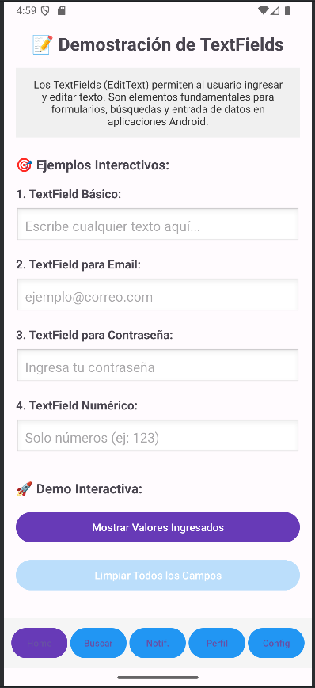
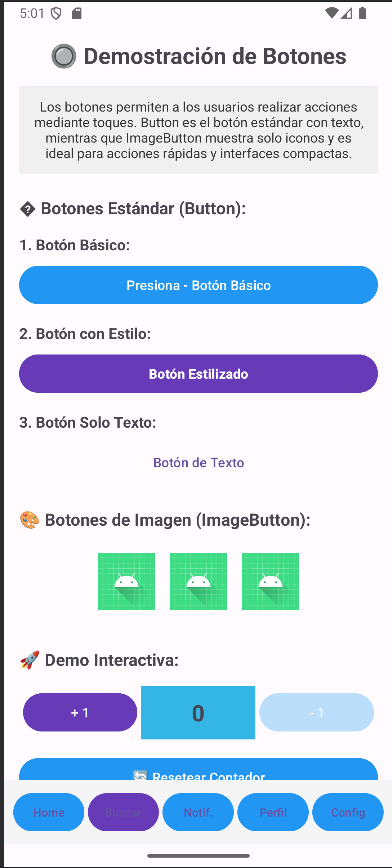
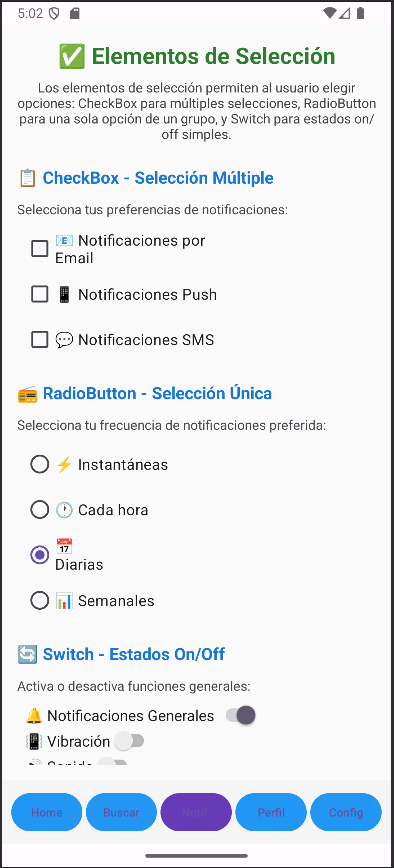
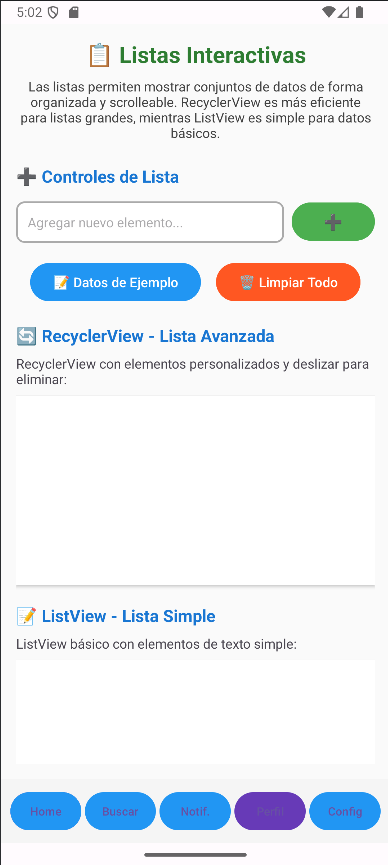
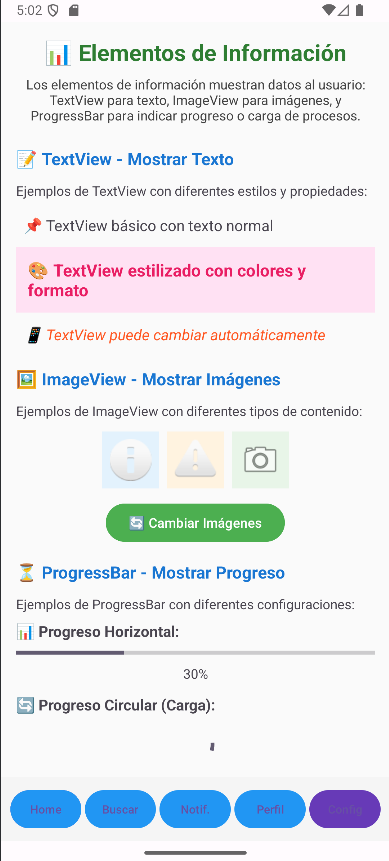
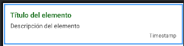

# Android App con Activity y 5 Fragments

Este proyecto es una aplicación Android desarrollada principalmente en **Kotlin**, con integración de código **Java** y soporte para mostrar contenido en **XML**. La aplicación se estructura alrededor de una **Activity principal** que contiene y gestiona **5 fragments** diferentes, permitiendo una navegación modular y escalable dentro de la interfaz de usuario.

## Descripción de la App

La app está diseñada como una arquitectura moderna de Android, donde la Activity principal actúa como contenedor para cinco fragments independientes. Cada fragment puede representar una sección diferente de la aplicación, como pantalla de inicio, perfil de usuario, ajustes, galería o cualquier otro módulo funcional. La integración de XML permite mostrar el contenido visual.

### Tecnologías utilizadas

- **Kotlin**: Lenguaje principal para la lógica y UI.
- **Java**: Compatibilidad y posibles utilidades heredadas.
- **XML**: Renderización de contenido dentro de la app.

## Instrucciones de Uso

1. **Clona el repositorio**
   ```bash
   git clone https://github.com/GarciaGarciaAramJesua/Android.git
   ```

2. **Abre el proyecto en Android Studio**
   - Selecciona la carpeta clonada.
   - Espera a que se sincronicen las dependencias.

3. **Ejecuta la aplicación**
   - Conecta un dispositivo físico o usa un emulador.
   - Haz clic en "Run" (▶️) para compilar y lanzar la app.

4. **Navegación**
   - La Activity principal mostrará los fragments; la navegación entre ellos puede ser mediante un menú, tabs o botones (según implementación).
   - Los fragments mostrarán contenido XML.

## Estructura básica de carpetas

- `/app/src/main/java/com/example/app/`: Código fuente en Kotlin y Java.
- `/app/src/main/res/layout/`: Layouts XML de la Activity y los fragments.

## Definición de fragments

- `HomeFragment`: Primer Fragment que contiene a los TextFields y su implementación.
- `NotificationsFragment`: Tercer Fragment que contiene a los Elementos de Selección y su implementación.
- `ProfileFragment`: Cuarto Fragment que contiene a las Listas y su implementación.
- `ProfileItemAdapter`: Fragment que maneja la implementación de un item que es utilizado recursivamente por las listas.
- `SearchFragment`: Segundo Fragment que contiene a los Botones y su implementación. 
- `SettingsFragment`: Quinto Fragment que contiene a los Elementos de Información y su implementación.
- `MainActivity`: Activity principal que contiene al primer fragment y que permite navegar por los demás fragments.


## Screenshots

Se presentan las screenshots de las vistas del proyecto (Se pueden encontrar más en `screenshots/Tarea3&Practica1/`)

### Home Fragment / Main Activity


### Search Fragment


### Notifications Fragment


### Profile Fragment 


### Profile Item


### Settings Fragment


---
