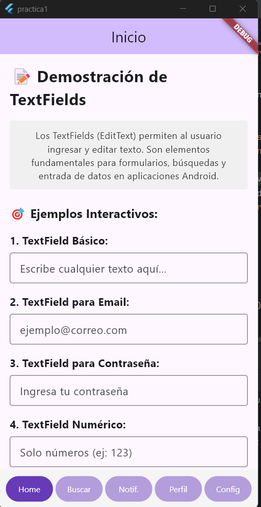
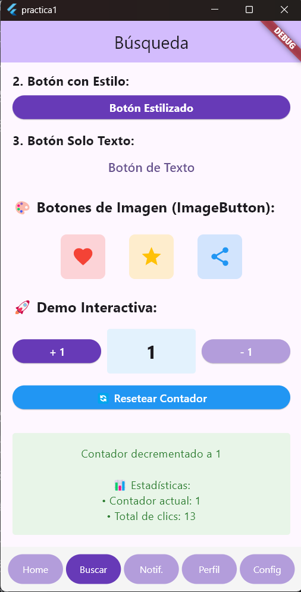
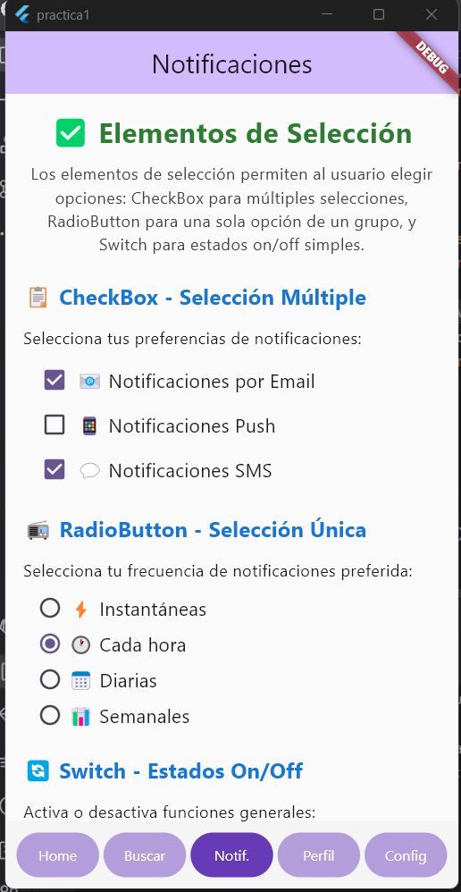
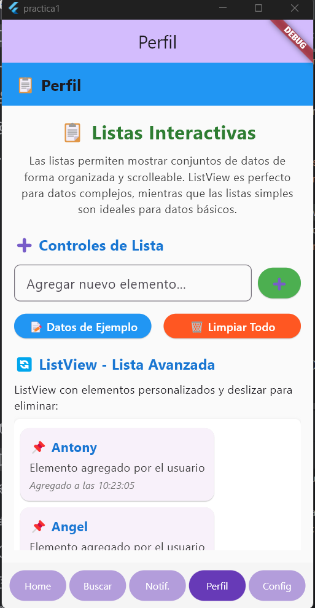
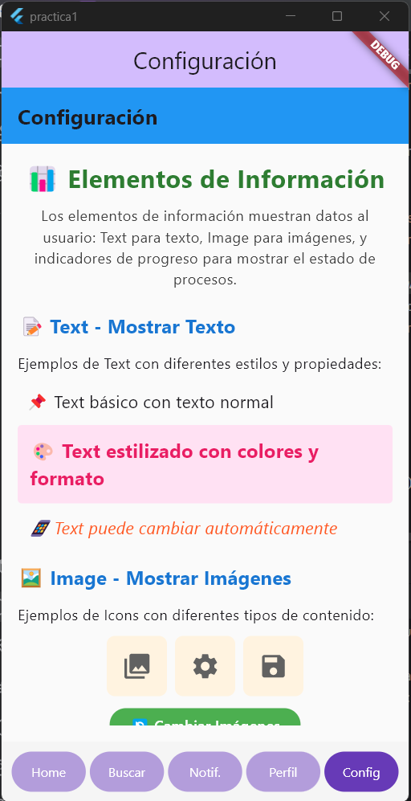

# Flutter App con Navegación por Pestañas y 5 Pantallas

Este proyecto es una aplicación móvil desarrollada en **Flutter** utilizando **Dart** como lenguaje principal. La aplicación se estructura alrededor de una **navegación por pestañas** que contiene y gestiona **5 pantallas** diferentes, permitiendo una interfaz de usuario modular y escalable con componentes interactivos.

## Descripción de la App

La app está diseñada con una arquitectura moderna de Flutter, donde la pantalla principal utiliza un sistema de navegación por pestañas para acceder a cinco secciones independientes. Cada pantalla representa un módulo funcional diferente con diversos widgets de Flutter, incluyendo campos de texto, botones, elementos de selección, listas y elementos informativos.

### Tecnologías utilizadas

- **Flutter**: Framework principal para el desarrollo multiplataforma.
- **Dart**: Lenguaje de programación para la lógica y UI.
- **Material Design**: Sistema de diseño para una interfaz moderna y consistente.

## Instrucciones de Uso

1. **Clona el repositorio**
   ```bash
   git clone https://github.com/GarciaGarciaAramJesua/Android.git
   ```

2. **Navega al directorio del proyecto Flutter**
   ```bash
   cd practica1
   ```

3. **Instala las dependencias**
   ```bash
   flutter pub get
   ```

4. **Ejecuta la aplicación**
   - Conecta un dispositivo físico o usa un emulador.
   ```bash
   flutter run
   ```

5. **Navegación**
   - La aplicación mostrará una barra de navegación inferior con pestañas para acceder a las diferentes pantallas.
   - Cada pantalla contiene widgets específicos de Flutter para demostrar diferentes funcionalidades.

## Estructura básica de carpetas

- `/lib/`: Código fuente principal en Dart.
- `/lib/main.dart`: Punto de entrada de la aplicación.
- `/lib/screens/`: Pantallas individuales de la aplicación.

## Definición de pantallas

- `HomeScreen`: Primera pantalla que contiene campos de texto (TextFields) y su implementación.
- `SearchScreen`: Segunda pantalla que contiene botones y su implementación.
- `NotificationsScreen`: Tercera pantalla que contiene elementos de selección y su implementación.
- `ProfileScreen`: Cuarta pantalla que contiene listas y su implementación.
- `SettingsScreen`: Quinta pantalla que contiene elementos de información y su implementación.
- `MainApp`: Aplicación principal que contiene la navegación por pestañas y permite navegar entre las diferentes pantallas.

## Screenshots

Se presentan las screenshots de las vistas del proyecto (Se pueden encontrar más en `./screenshots/`)

### Home Screen


### Search Screen


### Notifications Screen


### Profile Screen


### Settings Screen


---
